<div align="center">

<!-- Animated Header -->


<!-- Typing Animation -->
<a href="https://git.io/typing-svg"></a>

<br/>

<!-- Streamlined Badges -->
<p>
  
  
  
</p>

<!-- Social Links -->
<p>
  <a href="https://www.linkedin.com/in/aditya-sanskar-srivastav-a13b08327/">
    
  </a>
  <a href="https://leetcode.com/u/Aditya_Sanskar_78/">
    
  </a>
  <a href="mailto:adityasanskarsrivastav788@gmail.com">
    
  </a>
</p>

<!-- Divider -->


</div>

<!-- About Section -->
<div align="center">

##  About Me

</div>

I'm a **backend & distributed systems developer** who enjoys understanding how systems work end-to-end, not just shipping features.

I've worked across **frontend, backend, and infrastructure**, and I currently focus on **backend systems and large open-source codebases** where correctness, determinism, and maintainability matter.

```typescript
const aditya = {
    focus: "Backend Systems & Distributed Architecture",
    values: [
        "Reading production code over tutorials",
        "Debugging and tracing as core engineering skills",
        "Small, correct changes that compound over time"
    ],
    currentlyDoing: "Contributing to production OSS & learning Rust",
    askMeAbout: ["Go", "Systems Design", "API Architecture", "Open Source"]
};
```

<!-- Divider -->


<!-- Open Source Section -->
<div align="center">

##  Open Source & Systems Work

</div>

I actively contribute to **production-grade open-source projects**.

<table width="100%">
<tr>
<td width="50%" valign="top">

### 🔍 My Approach

- Study architecture before touching code
- Trace requests across components and layers
- Identify invariants, edge cases, and failure modes
- Make small, reviewable changes
- Write tests that prevent regressions
- Communicate clearly with maintainers

</td>
<td width="50%" valign="top">

### 🎯 Areas I Care About

- Distributed systems behavior
- Service meshes and gateways
- Control planes & config propagation
- API design and request lifecycles
- Deterministic and testable systems

```mermaid
%%{init: {'theme':'dark', 'themeVariables': { 'fontSize':'16px'}}}%%
graph LR
    A[Study<br/>Architecture] --> B[Trace<br/>Requests]
    B --> C[Identify<br/>Invariants]
    C --> D[Edge Cases &<br/>Failures]
    D --> E[Small<br/>Changes]
    E --> F[Write<br/>Tests]
    F --> G[Clear<br/>Communication]
    
    style A fill:#00ADD8,stroke:#fff,stroke-width:2px,color:#000
    style B fill:#00ADD8,stroke:#fff,stroke-width:2px,color:#000
    style C fill:#00ADD8,stroke:#fff,stroke-width:2px,color:#000
    style D fill:#00ADD8,stroke:#fff,stroke-width:2px,color:#000
    style E fill:#00ADD8,stroke:#fff,stroke-width:2px,color:#000
    style F fill:#00ADD8,stroke:#fff,stroke-width:2px,color:#000
    style G fill:#00ADD8,stroke:#fff,stroke-width:2px,color:#000
```

</td>
</tr>
</table>

<div align="center">



</div>

<!-- Divider -->


<!-- Tech Stack -->
<div align="center">

##  Technical Skills

</div>

### 🚀 Primary Languages

<p align="center">
  
  
  
</p>

### 🧪 Familiar / Learning

<p align="center">
  
  
  
</p>

### ⚙️ Backend & Systems

<p align="center">
  
  
  
  
</p>

<details>
<summary><b>💡 Backend Expertise (Click to expand)</b></summary>

<br/>

- RESTful and config-driven APIs
- Authentication & authorization
- Rate limiting and abuse prevention
- Concurrency & async execution
- Request tracing and debugging
- Writing regression-focused tests

</details>

### 🎨 Frontend (Strong Foundation)

<p align="center">
  
  
  
</p>

### 🗄️ Databases & Infrastructure (Hands-on)

<p align="center">
  
  
  
  
  
</p>

<!-- Divider -->


<!-- Core Focus -->
<div align="center">

## 🎯 Core Focus Areas

</div>

<table width="100%">
<tr>
<td width="50%" valign="top">

```go
// Areas I spend most time reasoning about
package main

func main() {
    focus := []string{
        "Request lifecycles",
        "Control-plane behavior",
        "Config propagation",
        "Failure modes",
        "Testing for determinism",
    }
}
```

</td>
<td width="50%" valign="top">

```rust
// Engineering values I optimize for
fn engineering_values() -> Vec<&'static str> {
    vec![
        "Correctness over cleverness",
        "Depth over speed",
        "Clarity over premature optimization",
        "Code for the next engineer",
    ]
}
```

</td>
</tr>
</table>

<!-- Divider -->


<!-- Engineering Mindset -->
<div align="center">

## 🧠 Engineering Mindset

</div>

<table width="100%">
<tr>
<td width="33%" align="center" valign="top">

### 📚 Learning


Prefer **depth** over surface-level speed

</td>
<td width="33%" align="center" valign="top">

### 🔍 Debugging


**Trace systems** before modifying them

</td>
<td width="33%" align="center" valign="top">

### ✅ Quality


Treat **tests and reviews** as part of the product

</td>
</tr>
</table>

<div align="center">

**Core Principles:**
- Optimize for long-term maintainability
- Assume someone else will read this code later
- Small, correct changes compound over time

</div>

<!-- Divider -->


<!-- Current Direction -->
<div align="center">

## 🎯 Current Direction

</div>

<table width="100%">
<tr>
<td width="50%" valign="top">

### 🔨 Active Work

- Deepening **Go backend & systems expertise**
- Contributing consistently to **large OSS projects**
- Strengthening **distributed systems intuition**

</td>
<td width="50%" valign="top">

### 📚 Learning Path

- Learning **Rust** to improve low-level reasoning
- Understanding **control plane architectures**
- Exploring **service mesh internals**

</td>
</tr>
</table>

<!-- Divider -->


<!-- GitHub Stats -->
<div align="center">

## 📊 GitHub Activity


<br/><br/>


<br/><br/>

<!-- Activity Graph -->


</div>

<!-- Divider -->


<!-- Connect Section -->
<div align="center">

## 🤝 Connect


<br/>

<a href="https://www.linkedin.com/in/aditya-sanskar-srivastav-a13b08327/">
  
</a>
<a href="https://leetcode.com/u/Aditya_Sanskar_78/">
  
</a>
<a href="mailto:adityasanskarsrivastav788@gmail.com">
  
</a>

<br/><br/>

### 💭 Personal Mantra


<br/>


</div>

<!-- Footer Wave -->


</div>
