```mermaid
%%{init: {'theme':'dark'}}%%
graph LR
    A[📚 Study<br/>Architecture] --> B[🔍 Trace<br/>Requests]
    B --> C[🧩 Understand<br/>Invariants]
    C --> D[⚠️ Edge<br/>Cases]
    D --> E[💡 Implement<br/>Solution]
    E --> F[✅ Write<br/>Tests]
    F --> G[💬 Clear<br/>Communication]
    
    style A fill:#00ADD8,stroke:#fff,stroke-width:2px,color:#000
    style B fill:#00ADD8,stroke:#fff,stroke-width:2px,color:#000
    style C fill:#00ADD8,stroke:#fff,stroke-width:2px,color:#000
    style D fill:#00ADD8,stroke:#fff,stroke-width:2px,color:#000
    style E fill:#00ADD8,stroke:#fff,stroke-width:2px,color:#000
    style F fill:#00ADD8,stroke:#fff,stroke-width:2px,color:#000
    style G fill:#00ADD8,stroke:#fff,stroke-width:2px,color:#000
```

<div align="center">

<!-- Animated Header -->


<!-- Typing Animation -->
<a href="https://git.io/typing-svg"></a>

<br/>

<!-- Glowing Badges -->
<p>
  
  
  
</p>

<!-- Social Links with Hover Effect -->
<p>
  <a href="https://www.linkedin.com/in/aditya-sanskar-srivastav-a13b08327/">
    
  </a>
  <a href="https://leetcode.com/u/Aditya_Sanskar_78/">
    
  </a>
  <a href="mailto:adityasanskarsrivastav788@gmail.com">
    
  </a>
</p>

<!-- Divider -->


</div>

<!-- About Section with Gradient -->
<div align="center">

##  About Me

</div>

```typescript
const aditya = {
    role: "Backend Systems Engineer",
    focus: ["Distributed Systems", "Production-Grade Code", "Open Source"],
    philosophy: {
        code: "Correctness > Cleverness",
        growth: "Depth > Speed",
        impact: "Understanding > Memorization"
    },
    currentlyLearning: ["Rust", "Control Planes", "Service Meshes"],
    askMeAbout: ["Go", "System Design", "API Architecture", "Open Source"],
    funFact: "I trace requests end-to-end through systems before making changes 🔍"
};
```

<div align="center">

<!-- Stats Cards -->


<!-- Streak Stats -->


<!-- Activity Graph -->


</div>

<!-- Divider -->


<!-- Tech Stack with Icons -->
<div align="center">

##  Tech Stack

</div>

### 🚀 Languages & Core

<p align="center">
  
  
  
  
  
  
</p>

### ⚙️ Backend & Systems

<p align="center">
  
  
  
  
  
</p>

### 🎨 Frontend

<p align="center">
  
  
  
  
</p>

### 🗄️ Databases & Caching

<p align="center">
  
  
  
  
</p>

### ☁️ DevOps & Tools

<p align="center">
  
  
  
  
  
  
</p>

<!-- Divider -->


<!-- Expertise Section -->
<div align="center">

## 🎯 Core Expertise & Focus Areas

</div>

<table width="100%">
<tr>
<td width="50%" valign="top">

### 🌐 Distributed Systems
```go
expertise := []string{
    "Service Meshes",
    "API Gateways", 
    "Control Planes",
    "Config-Driven Systems",
    "Request Tracing",
    "Failure Handling",
}
```

</td>
<td width="50%" valign="top">

### 🔧 Backend Engineering
```rust
fn core_skills() -> Vec<&'static str> {
    vec![
        "RESTful API Design",
        "Authentication Systems",
        "Rate Limiting",
        "Concurrency Patterns",
        "Testing & Debugging",
        "Performance Optimization",
    ]
}
```

</td>
</tr>
</table>

<!-- Divider -->


<!-- Open Source Section -->
<div align="center">

##  Open Source Philosophy

</div>

<div align="center">



</div>

<br/>

<details>
<summary><b>🚀 My Contribution Approach (Click to expand)</b></summary>

<br/>

| Phase | Focus | Goal |
|-------|-------|------|
| 🔬 **Research** | Study codebase architecture deeply | Understand system design patterns |
| 🎯 **Analysis** | Trace request lifecycle end-to-end | Identify critical paths & dependencies |
| 🛡️ **Safety** | Find invariants and edge cases | Prevent regressions |
| 💻 **Implementation** | Write clear, maintainable code | Easy to review and understand |
| ✅ **Testing** | Comprehensive test coverage | Build confidence in changes |
| 📝 **Communication** | Document decisions clearly | Help future maintainers |

**Principle:** Prefer small, correct changes over large, risky ones.

</details>

<!-- Divider -->


<!-- GitHub Trophies -->
<div align="center">

## 🏆 GitHub Trophies


</div>

<!-- Divider -->


<!-- Current Focus Section -->
<div align="center">

## 🎯 Current Focus & Goals (2024)

</div>

<table width="100%">
<tr>
<td width="33%" valign="top" align="center">

### 🔨 Building


- Deepening **Go expertise**
- **Distributed systems**
- Production debugging
- System design patterns

</td>
<td width="33%" valign="top" align="center">

### 📚 Learning


- **Rust** fundamentals
- Control plane architectures
- Service mesh internals
- Performance optimization

</td>
<td width="33%" valign="top" align="center">

### 🌟 Contributing


- **5+ major OSS** projects
- Write technical blogs
- Mentor developers
- Build open tools

</td>
</tr>
</table>

<div align="center">

### 📊 2024 Progress


**Q1 Goals Completed**

</div>

<!-- Divider -->


<!-- Snake eating contribution -->
<div align="center">

## 📈 Contribution Graph

<picture>
  <source media="(prefers-color-scheme: dark)" srcset="https://raw.githubusercontent.com/Aditya7880900936/Aditya7880900936/output/github-contribution-grid-snake-dark.svg">
  <source media="(prefers-color-scheme: light)" srcset="https://raw.githubusercontent.com/Aditya7880900936/Aditya7880900936/output/github-contribution-grid-snake.svg">
  
</picture>

</div>

<!-- Divider -->


<!-- Engineering Principles -->
<div align="center">

## 💡 Engineering Principles

</div>

<table width="100%">
<tr>
<td width="50%" valign="top">

```python
class EngineeringMindset:
    principles = {
        "code_quality": "Correctness over cleverness",
        "learning": "Depth over speed",
        "optimization": "Clarity before performance",
        "testing": "Tests are part of the product",
        "collaboration": "Code for the next engineer"
    }
    
    @staticmethod
    def approach():
        return "Understand → Design → Test → Implement"
```

</td>
<td width="50%" valign="top">

```javascript
const beliefs = {
    growth: {
        best_way: "Reading production code",
        core_skill: "Debugging & tracing",
        long_term: "Strong fundamentals compound"
    },
    quality: {
        priority: "Maintainability",
        focus: "Edge cases & invariants",
        method: "Small, correct changes"
    }
};
```

</td>
</tr>
</table>

<!-- Divider -->


<!-- Connect Section -->
<div align="center">

## 🤝 Let's Connect & Collaborate


**I'm always open to discussing:**
- 🔧 Systems Architecture
- 🌐 Open Source Projects
- 💡 Engineering Best Practices
- 🚀 Distributed Systems Design

<br/>

<a href="https://www.linkedin.com/in/aditya-sanskar-srivastav-a13b08327/">
  
</a>
<a href="https://leetcode.com/u/Aditya_Sanskar_78/">
  
</a>
<a href="mailto:adityasanskarsrivastav788@gmail.com">
  
</a>

<br/><br/>

### 💭 Personal Mantra


</div>

<!-- Profile Counter -->
<div align="center">

<br/>


</div>

<!-- Footer Wave -->


</div>
